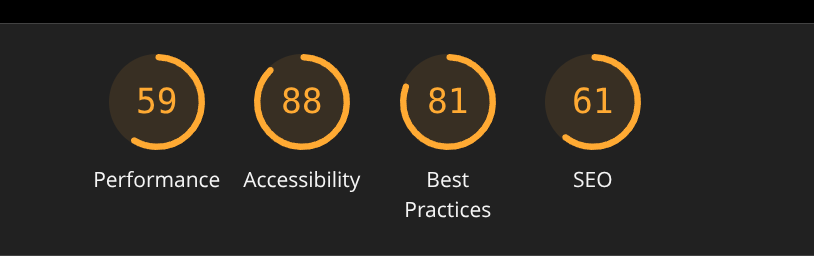
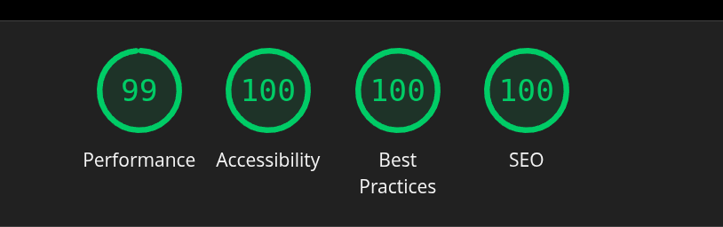

# autoresearch-lighthouse-optimizer


Autonomous Lighthouse performance optimization for web applications.

The idea: give an AI agent a real web application and let it autonomously optimize for 100% Lighthouse scores overnight. It modifies CSS, JavaScript, templates, and server configs, runs Lighthouse audits, checks if scores improved, keeps or discards changes, and repeats. You wake up in the morning to a log of experiments and (hopefully) perfect scores.

By design, this is a **fork of karpathy's autoresearch** but repurposed for **web performance optimization** instead of neural network training. The core autonomous experimentation loop remains the same, but adapted for Lighthouse metrics.

## How it works

The repo has three main files:

- **`lighthouse_audit.py`** — fixed audit runner. Runs Lighthouse audits and collects metrics. Not modified by the agent.
- **`optimize.py`** — the single file the agent edits. Contains optimization strategies for performance, accessibility, SEO, and best practices. **This file is edited by the agent**.
- **`program-lighthouse.md`** — instructions for the AI agent. Describes the optimization loop and constraints.

## Quick start

**Requirements:** A single machine with Chrome/Chromium, Python 3.10+, [uv](https://docs.astral.sh/uv/), and access to the target web application.

```bash
# 1. Install uv project manager (if you don't already have it)
curl -LsSf https://astral.sh/uv/install.sh | sh

# 2. Install dependencies
uv sync

# 3. Ensure Lighthouse is available
npm install -g lighthouse

# 4. Run a baseline audit
uv run optimize.py
```

## Running the agent

Spin up your Claude/Codex or whatever agent you prefer in this repo, then prompt something like:

```
Hi, have a look at program-lighthouse.md and let's kick off a new optimization run!
```

The `program-lighthouse.md` file contains the agent instructions.

## Project structure

```
lighthouse_audit.py  — audit runner (do not modify)
optimize.py          — optimization strategies (agent modifies this)
program-lighthouse.md — agent instructions
pyproject.toml       — dependencies
```

## Design choices

- **Single file to modify.** The agent only touches `optimize.py`. This keeps the scope manageable and diffs reviewable.
- **Fixed audit target.** Lighthouse audits run on the same URLs each time, making experiments directly comparable.
- **Self-contained.** No external dependencies beyond Lighthouse CLI and a few small packages.

## Lighthouse Metrics

The optimizer targets 100% scores in all categories:

1. **Performance** — FCP, LCP, TBT, CLS, SI, TTI
2. **Accessibility** — WCAG compliance, ARIA labels, color contrast
3. **Best Practices** — Security, modern standards, no deprecated APIs
4. **SEO** — Meta tags, structured data, mobile-friendly

## Optimization Strategies

The agent can implement:

### Performance
- Enable compression (gzip, brotli)
- Optimize images (WebP, lazy loading)
- Minimize CSS/JS bundles
- Preload critical resources
- Defer non-critical JavaScript
- Enable HTTP/2
- Database query optimization

### Accessibility
- Add ARIA labels and roles
- Fix color contrast
- Add skip links
- Ensure keyboard navigation
- Fix touch target sizes

### Best Practices
- Force HTTPS for external scripts
- Remove console.log/debugger
- Add security headers
- Use passive event listeners

### SEO
- Add meta tags (description, OG, Twitter)
- Fix crawlable links
- Add structured data
- Allow search engine indexing

## SEO Improvement Example

Here's a real example of SEO score improvement (86 → 100):

**Before (SEO: 86):**


**After (SEO: 100):**


## Logging results

Results are logged to `results-lighthouse.tsv` (tab-separated):

```
commit	performance	accessibility	best_practices	seo	status	description
a1b2c3d	87.0	92.0	100.0	95.0	keep	baseline
b2c3d4e	91.0	92.0	100.0	95.0	keep	enable gzip compression
```

## License

MIT

## Origin

This project is a fork of [karpathy/autoresearch](https://github.com/karpathy/autoresearch), adapted from autonomous neural network research to autonomous web performance optimization.
